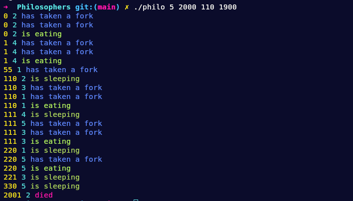
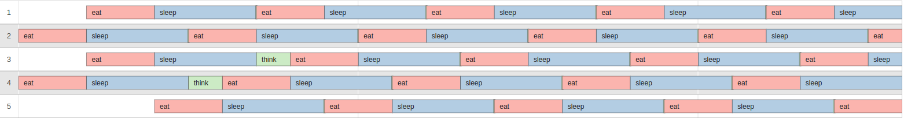

# Philosophers

This project is about learning how threads work by precisely timing a group of philosophers on when to pick up forks and eat spaghetti without dying from hunger.

## Tehnologies

## Rules

- One or more philosophers sit at a round table.
There is a large bowl of spaghetti in the middle of the table.
- The philosophers alternatively `eat`, `think`, or `sleep`.
- There are as many forks as philosophers.
-  A philosopher takes their right and their left forks to eat, one in each hand.
- When a philosopher has finished eating, they put their forks back on the table and
start sleeping. Once awake, they start thinking again. The simulation stops when
a philosopher dies of starvation.
- Philosophers don’t know if another philosopher is about to die.
- Program should take the following arguments:

` number_of_philosophers time_to_die time_to_eat time_to_sleep
[number_of_times_each_philosopher_must_eat] `
- Philosopher number 1 sits next to philosopher number number_of_philosophers.
Any other philosopher number N sits between philosopher number N - 1 and philosopher number N + 1.
-  A displayed state message should not be mixed up with another message.
- A message announcing a philosopher died should be displayed no more than 10 ms
after the actual death of the philosopher.
## Restrictions
- Each philosopher should be a thread
- To prevent philosophers from duplicating forks, you should protect the forks state
with a mutex for each of them.
## Screenshots

./philo 5 500 200 300 5

